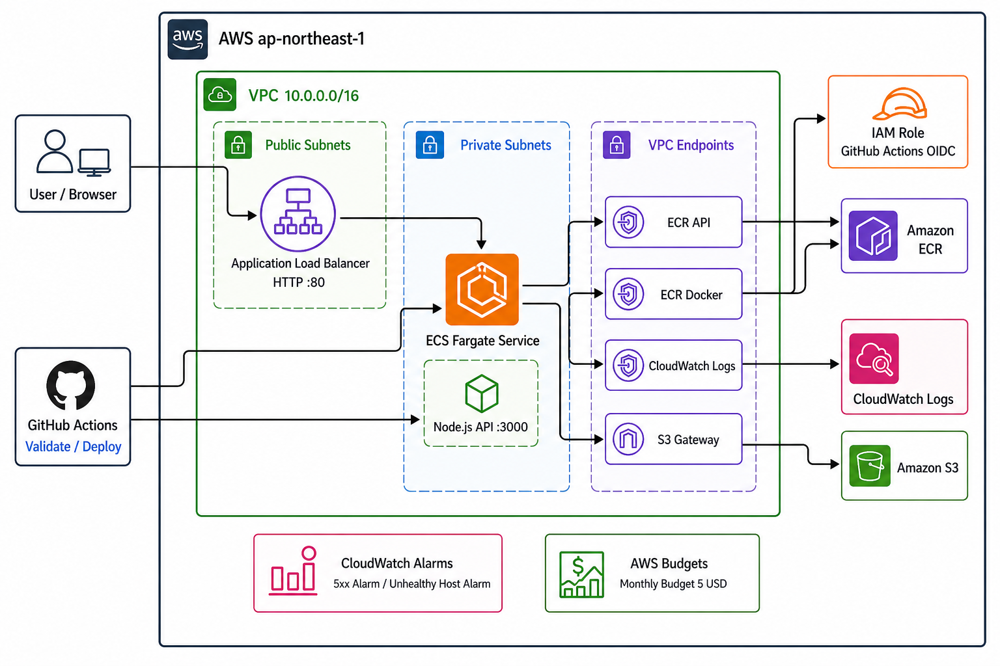

# AWS Platform Portfolio

AWS上にコンテナアプリケーション基盤を構築するTerraformポートフォリオです。

Node.js APIをDocker化してAmazon ECRへ登録し、Private Subnet上のECS Fargateで実行します。外部公開の入口はApplication Load Balancerに限定し、GitHub ActionsからOIDC認証を使ってデプロイします。

このリポジトリでは、インフラの設計・構築だけでなく、CI/CD、監視、コスト管理、疎通確認、`terraform destroy` による削除までを一連の運用として実装・検証しています。

## 構成図



ネットワーク境界、通信経路、各リソースの役割は [アーキテクチャと設計判断](docs/architecture.md) にまとめています。

## 技術的な特徴

| 観点 | 実装内容 |
| --- | --- |
| Infrastructure as Code | Terraform moduleでネットワーク、セキュリティ、ECS、VPC Endpoint、OIDC、Budgetsを分割 |
| ネットワーク | ALBをPublic Subnet、ECS TaskをPrivate Subnetへ配置 |
| 通信制御 | Security Groupで `Internet -> ALB -> ECS` の経路とECSのアウトバウンドを制限 |
| コンテナ基盤 | Docker imageをECRへ登録し、ECS Fargateで実行 |
| Private接続 | ECSからECR、S3、CloudWatch Logsへの接続にVPC Endpointを使用 |
| CI/CD | GitHub Actionsで検証し、手動Deploy workflowからECR pushとECS更新を実行 |
| AWS認証 | 長期Access Keyを保存せず、GitHub Actions OIDCでAWS Roleを引き受け |
| IAM | ECS Task Execution RoleとGitHub Actions Roleを用途別に最小権限化 |
| 監視 | CloudWatch Logs、ALB 5xx Alarm、unhealthy host Alarmを実装 |
| コスト管理 | AWS Budgets、ECR Lifecycle Policy、通常時 `desired_count = 0`、検証後のdestroyを採用 |

## 主な設計判断

### ALBのみを外部公開

ECS TaskはPrivate Subnetに配置し、インターネットから直接アクセスできない構成にしています。外部公開の入口をALBに限定することで、アプリケーションへの通信経路を制御します。

### VPC Endpointを採用

Private Subnet上のECS TaskがECRからイメージを取得し、CloudWatch Logsへログを送信できるよう、ECR API、ECR Docker、CloudWatch LogsのInterface EndpointとS3 Gateway Endpointを構成しています。

本構成では、アクセス先をAWSサービスに限定し、NAT Gatewayを使用しない設計を選択しています。実際のコストは稼働時間、AZ数、通信量によって比較が必要です。

### OIDCによるデプロイ

GitHub Actionsには長期Access Keyを保存しません。OIDCで、このリポジトリの `main` ブランチだけが引き受けられるIAM Roleを使用します。

### 短時間検証後に削除

学習用dev環境のため、ECS Serviceは通常 `desired_count = 0` とします。疎通確認時だけTaskを起動し、確認後は `terraform destroy` でAWSリソースを削除します。

## 使用技術

- AWS: VPC、ECR、ECS Fargate、ALB、IAM、VPC Endpoint、CloudWatch、AWS Budgets
- Infrastructure as Code: Terraform
- CI/CD: GitHub Actions、OIDC
- Application: Node.js、Express
- Container: Docker

## 実行方法

前提:

- Terraform、Docker、AWS CLIが利用できる
- AWS SSO / IAM Identity Centerで認証済み
- `infra/environments/dev/terraform.tfvars` を設定済み

Terraformを初期化・検証し、AWS基盤を作成します。

```bash
cd infra/environments/dev
terraform init
terraform fmt -recursive ../..
terraform validate
terraform plan
terraform apply
```

GitHub ActionsのDeploy workflowを手動実行した後、ECS Taskを1台起動して疎通確認します。

```bash
terraform apply -auto-approve -var ecs_desired_count=1
curl http://$(terraform output -raw alb_dns_name)/health
```

確認後はAWSリソースを削除し、Terraform管理リソースが残っていないことを確認します。

```bash
terraform destroy
terraform plan -destroy
terraform state list
```

## CI/CD

### Validate workflow

push時に以下を自動検証します。

- Node.js依存関係のインストールと構文チェック
- Docker image build
- Terraform format check
- Terraform init / validate

### Deploy workflow

意図しないAWS課金を避けるため、手動実行に限定しています。

- GitHub Actions OIDCでAWSへ認証
- Docker imageをビルド
- ECRへ `latest` とcommit SHA tagをpush
- ECS Serviceをforce new deployment

## 検証結果

以下の一連の流れを実環境で確認済みです。

| 項目 | 結果 |
| --- | --- |
| Terraform fmt / init / validate / plan | 成功 |
| Terraform apply | 成功 |
| GitHub Actions Validate workflow | 成功 |
| GitHub Actions Deploy workflow | 成功 |
| Docker image build / ECR push | 成功 |
| ECS Fargate Task起動 | 成功 |
| ALB Target Group health check | healthy |
| ALB経由の `/health` | HTTP 200 |
| CloudWatch Logsへのログ出力 | 成功 |
| CloudWatch Alarm作成 | 成功 |
| AWS Budgets作成 | 成功 |
| ECR Lifecycle Policy作成 | 成功 |
| Terraform destroy | 成功 |
| destroy後の残リソース確認 | `No changes` / stateが空 |

## コストと削除方針

- AWS Budgetsの通知上限は月額5 USDを想定
- ECS Taskは通常 `desired_count = 0`
- Deploy workflowは手動実行
- ECRのuntagged imageは1日後に削除
- tagged imageは直近10個を保持
- 検証完了後は `terraform destroy`

VPC Interface Endpoint、ALB、ECS Fargateなどは稼働時間に応じて課金されます。構成を作成する前に [コストドキュメント](docs/cost.md) を確認してください。

## 関連ドキュメント

- [アーキテクチャと設計判断](docs/architecture.md)
- [セキュリティ設計](docs/security.md)
- [コスト管理](docs/cost.md)

## 今後の改善候補

- HTTPS化
- デプロイ後の自動ヘルスチェック
- ECS Execの導入検討
- WAFの追加
- Private SubnetへのRDS追加
