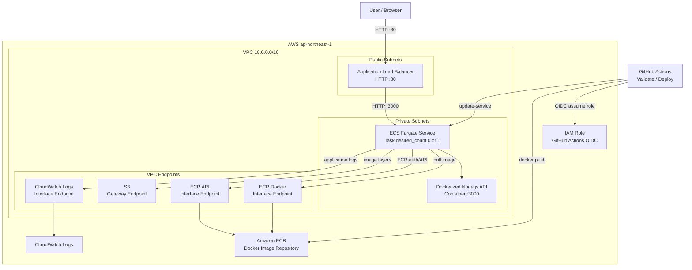

# AWS Platform Portfolio

## 概要

このリポジトリは、AWS上にコンテナアプリケーション基盤をTerraformで構築するポートフォリオです。

主目的は、アプリケーション開発ではなく、以下の設計・構築スキルを示すことです。

- TerraformによるInfrastructure as Code
- VPC / Public Subnet / Private Subnetのネットワーク設計
- Security Groupによる通信制御
- Docker化したNode.js APIのECR登録
- ECS Fargateによるコンテナ実行
- ALBによるHTTP公開とヘルスチェック
- VPC EndpointによるPrivate SubnetからのAWSサービス到達
- GitHub Actions OIDCによる長期Access Keyを使わないデプロイ
- 検証後に `terraform destroy` で削除できる運用
- AWS Budgetsによる月額コスト監視

## このポートフォリオで証明すること

このリポジトリでは、単にAWSリソースを作るだけでなく、コンテナアプリケーションを安全に公開し、検証後に削除できる一連の流れを示しています。

| 観点 | 内容 |
| --- | --- |
| IaC | Terraform moduleでネットワーク、セキュリティ、ECS、VPC Endpoint、GitHub Actions OIDCを分割して管理 |
| ネットワーク設計 | ALBをPublic Subnet、ECS TaskをPrivate Subnetに配置し、外部公開の入口をALBに限定 |
| セキュリティ | Security Groupで `Internet -> ALB -> ECS` の通信経路を制限し、GitHub ActionsはOIDCでAWSへ認証 |
| コンテナ基盤 | Docker imageをECRへ登録し、ECS Fargateで起動、ALB Target Groupのhealth checkで正常性を確認 |
| 運用 | CloudWatch Logs確認、CloudWatch Alarm、ECS desired countの切り替え、`terraform destroy` による削除まで手順化 |
| コスト管理 | 学習用dev環境では通常 `desired_count = 0` とし、NAT GatewayではなくVPC Endpointを採用 |

面接やレビューでは、以下を説明できることを重視しています。

- なぜECS TaskをPrivate Subnetに置くのか
- なぜALBだけをPublic Subnetに置くのか
- なぜNAT GatewayではなくVPC Endpointを使うのか
- なぜGitHub Actionsに長期Access Keyを置かずOIDCを使うのか
- なぜ検証後に `terraform destroy` する運用にしているのか

## 構成



ECSタスクはPrivate Subnetに配置し、外部から直接アクセスできない構成にしています。
外部公開の入口はPublic Subnet上のALBに限定しています。

Private Subnet上のECSタスクがECRからイメージをpullし、CloudWatch Logsへログを送信できるように、NAT GatewayではなくVPC Endpointを利用しています。

## 使用技術

- AWS
- Terraform
- Docker
- Amazon ECR
- Amazon ECS Fargate
- Application Load Balancer
- VPC Endpoint
- CloudWatch Logs
- Node.js
- Express

## ディレクトリ構成

```text
.
├── .github/
│   └── workflows/
│       ├── deploy.yml
│       └── validate.yml
├── app/
│   ├── Dockerfile
│   ├── package.json
│   └── src/
│       └── index.js
├── docs/
│   ├── architecture.md
│   ├── cost.md
│   ├── operations.md
│   └── security.md
└── infra/
    ├── environments/
    │   └── dev/
    │       ├── main.tf
    │       ├── outputs.tf
    │       ├── terraform.tfvars.example
    │       └── variables.tf
    └── modules/
        ├── ecs/
        ├── endpoints/
        ├── github_oidc/
        ├── budgets/
        ├── network/
        └── security/
```

## アプリケーション

検証用のNode.js APIを用意しています。

エンドポイント:

- `GET /`
- `GET /health`

`/health` はALBのヘルスチェックでも利用します。

## ローカル実行

```bash
cd app
npm install
npm start
```

確認:

```bash
curl http://localhost:3000/health
```

## Docker実行

```bash
cd app
docker build -t aws-platform-api .
docker run --rm -p 3000:3000 aws-platform-api
```

確認:

```bash
curl http://localhost:3000/health
```

## Terraform

dev環境のTerraformは以下にあります。

```bash
cd infra/environments/dev
```

初期化:

```bash
terraform init
```

フォーマット:

```bash
terraform fmt -recursive ../..
```

検証:

```bash
terraform validate
```

差分確認:

```bash
terraform plan
```

作成:

```bash
terraform apply
```

削除:

```bash
terraform destroy
```

## CI

GitHub Actionsで以下の検証を行います。

- Node.js依存関係のインストール
- アプリケーション構文チェック
- Docker image build
- Terraform format check
- Terraform init
- Terraform validate

push時のAWS自動デプロイは行いません。
AWSへの反映は、手動実行用のDeploy workflowを明示的に起動した場合だけ行います。

手動実行用のDeploy workflowでは、以下を行います。

- GitHub OIDCでAWSへ認証
- Docker image build
- ECRへ `latest` とcommit SHA tagをpush
- ECS Serviceをforce new deployment

Deploy workflowを使う前に、TerraformでAWS基盤とGitHub Actions OIDC Roleを作成しておく必要があります。

```bash
cd infra/environments/dev
terraform apply
```

GitHub repository variablesへ以下を設定します。

- `AWS_ROLE_ARN`
- `AWS_REGION`
- `ECR_REPOSITORY`
- `ECS_CLUSTER`
- `ECS_SERVICE`

このリポジトリでは学習後に `terraform destroy` でAWSリソースを削除する運用にしています。
destroy後はGitHub Actions OIDC Roleも削除されるため、Deploy workflowを再実行する前に再度 `terraform apply` が必要です。

## ECSタスク起動確認

この構成では、Fargateの不要な課金を避けるため、dev環境のECS Serviceは通常 `desired_count = 0` にしています。

API疎通を確認する場合のみ、一時的にタスクを1台起動します。

```bash
terraform apply -auto-approve -var ecs_desired_count=1
```

ALB DNS名を確認します。

```bash
terraform output -raw alb_dns_name
```

ALB経由でAPIを確認します。

```bash
curl http://$(terraform output -raw alb_dns_name)/health
```

確認後はタスク数を0に戻します。

```bash
terraform apply -auto-approve
```

## ログ確認

ECS/Fargate上のアプリケーションログはCloudWatch Logsへ出力します。

ロググループ:

```text
/ecs/aws-platform-portfolio-dev-api
```

確認手順は [運用](docs/operations.md) にまとめています。

ログ確認では、以下を確認します。

- ECS Taskが起動したか
- アプリケーションが起動時にエラーを出していないか
- ALB経由のリクエストがAPIまで到達しているか
- image pullや権限エラーが発生していないか

## 監視

CloudWatch Alarmで以下を監視します。

- ALBが生成したHTTP 5xxレスポンス
- Target Groupに登録されたunhealthy host

dev環境は通常 `desired_count = 0` のため、ECS Taskが0台であること自体は異常として監視しません。
通知先SNSは環境ごとのメール確認が必要になるため、現時点ではAlarm本体のみTerraformで管理します。

## コスト監視

AWS Budgetsで月額コストを監視できるようにしています。

Budgetは個人のメールアドレスへ通知するため、デフォルトでは無効です。
有効化する場合は `terraform.tfvars` に以下を設定します。

```hcl
enable_budget             = true
budget_monthly_limit_usd  = "5"
budget_notification_email = "your-email@example.com"
```

この構成ではBudget ActionsとBudget Reportsは使いません。
月額コストのBudget通知だけを使い、想定外の課金に気づくための最低限の設定にしています。

## 設計上のポイント

### Public / Private Subnet分離

ALBはPublic Subnetに配置し、ECSタスクはPrivate Subnetに配置しています。

これにより、外部公開する入口をALBに限定し、アプリケーション本体への直接アクセスを防ぎます。

### Security Group制御

通信は以下のように制限しています。

```text
Internet -> ALB : TCP 80
ALB -> ECS Task : TCP 3000
ECS Task -> VPC Endpoint : TCP 443
```

ECSタスクはALBからの通信のみ受ける設計です。

### VPC Endpoint

Private Subnet上のECSタスクがECRとCloudWatch Logsへ到達するため、以下を作成しています。

- ECR API Interface Endpoint
- ECR Docker Interface Endpoint
- CloudWatch Logs Interface Endpoint
- S3 Gateway Endpoint

NAT Gatewayはコストが高くなりやすいため、今回の学習用構成では採用していません。

### ECR削除

ECRリポジトリ内にDockerイメージが残っていると、通常は `terraform destroy` で削除に失敗します。

このリポジトリでは、学習環境を確実に削除できるように以下を設定しています。

```hcl
force_delete = true
```

また、不要なDocker imageが増え続けないようにLifecycle Policyを設定しています。

- untagged imageは1日後に削除
- tagged imageは直近10個を保持

## 実施済みの検証

- Terraform `fmt`
- Terraform `init`
- Terraform `validate`
- Terraform `plan`
- Terraform `apply`
- Docker image build
- ECR push
- ECS Fargate task起動
- ALB Target Group health check
- ALB経由の `/health` 疎通確認
- CloudWatch Logsへの実ログ出力確認
- ECS desired countを0へ戻す運用
- `terraform destroy`
- GitHub Actionsによる検証CI
- GitHub Actions OIDC IAM Role module
- GitHub Actions OIDC IAM Role作成
- GitHub ActionsによるECR push / ECS deploy workflow成功
- destroy済み状態からの最終再作成・Deploy・疎通確認成功
- destroy後にTerraform管理リソースが残っていないことの確認
- CloudWatch AlarmによるALB 5xx / unhealthy host監視
- AWS Budgetsによる月額コスト監視

## 関連ドキュメント

- [アーキテクチャ](docs/architecture.md)
- [セキュリティ](docs/security.md)
- [コスト](docs/cost.md)
- [運用](docs/operations.md)

## 今後の改善候補

- ECS Execの検討
- HTTPS化
- WAF追加
- IAM権限の最小化
- RDSをPrivate Subnetに追加
